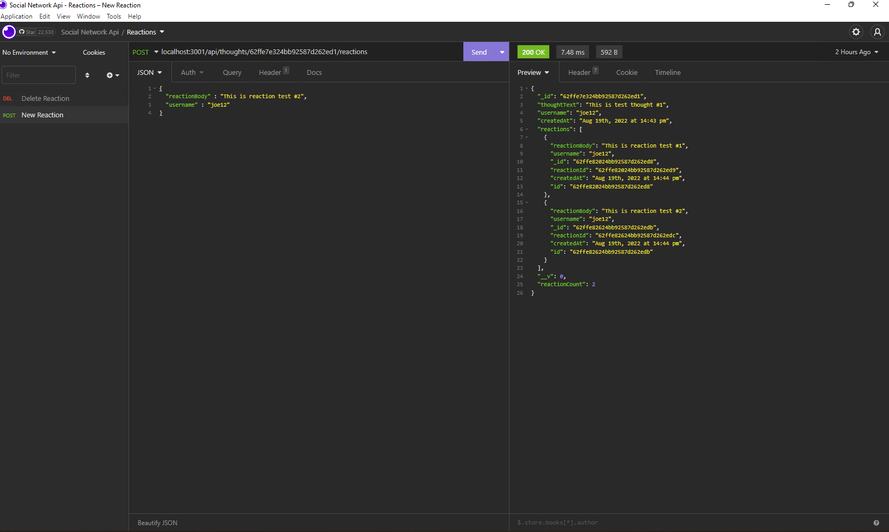
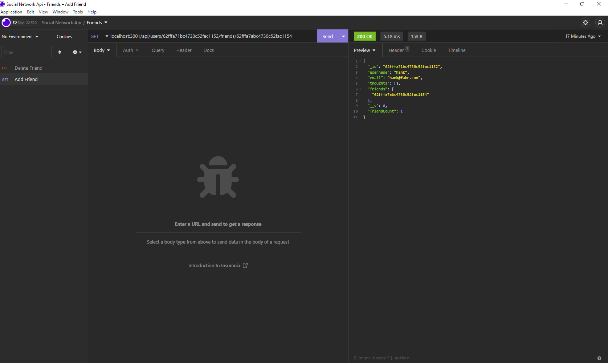
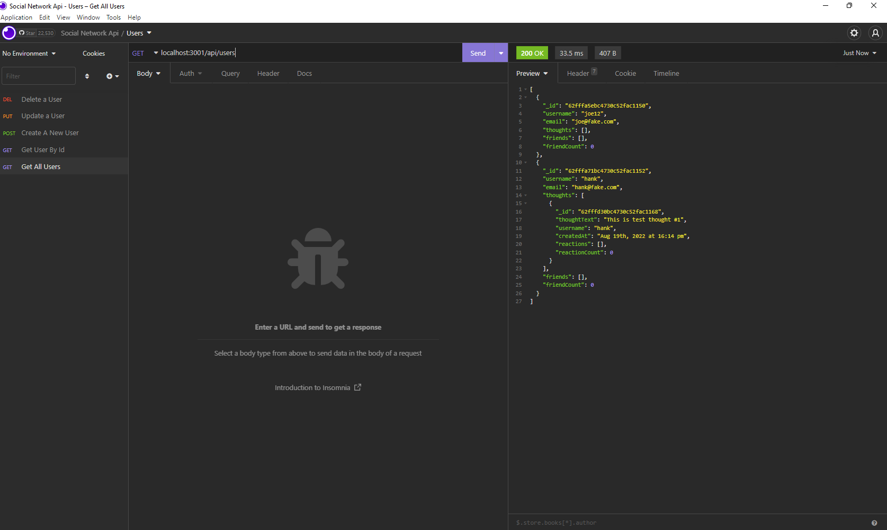
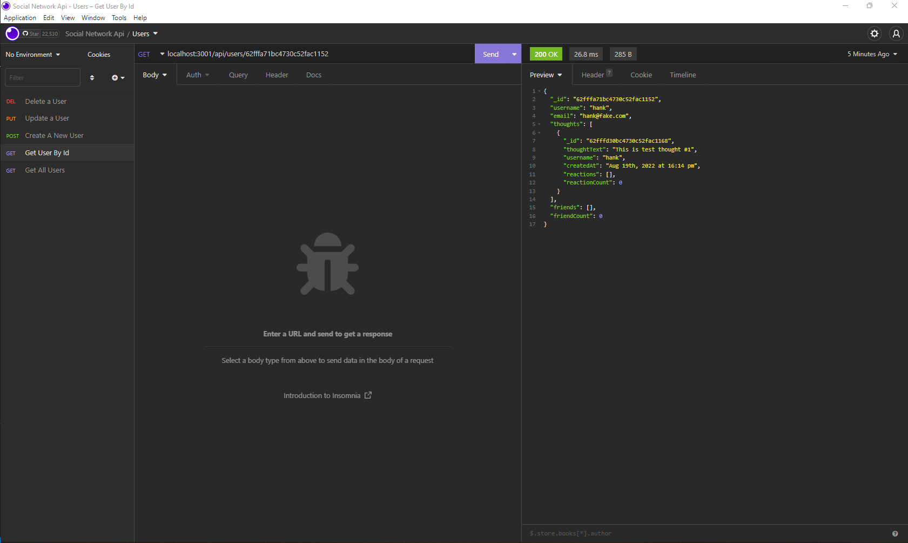

# social-network-api

## Purpose
This a backend database for a social network api. It allows you to connect to the database and perform basic CRUD operations

## Built With
* Node
* Express
* Mongoose

## Usage
This backend allows you to store users, thoughts, and reactions. A user has an array of thoughts, and also an array of friends. Thoughts are assigned to a user, and they have a subdocument of reactions on them. 

## Contribution
Made by Joe White

## Screenshots
 
 
 
 
[walkthrough](https://watch.screencastify.com/v/qYndHQoYOOAc4KgfVRQA)